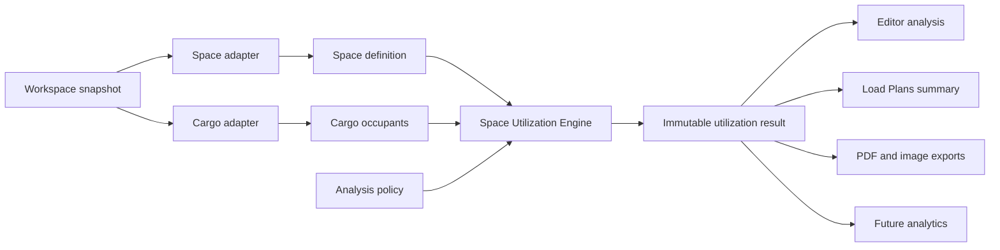

# Thermal Load Utilization — Architecture and Product Audit

**Date:** 2026-08-03

**Branch:** `feat/thermal-load-utilization`

**Status:** Architecture and product audit only; no implementation technology or application code is
approved by this document.

## 1. Purpose and terminology

Thermal Load Utilization is a visual cargo-space utilization capability. It is **not** refrigeration
analysis, temperature mapping, cooling capacity, thermal transfer, or cold-chain compliance.

The product must explain:

- occupied cargo volume percentage;
- empty available-space percentage;
- density distribution inside the selected space; and
- visually inefficient loading areas.

The preferred customer-facing label is **Space Utilization** or **Load Utilization**, with “Thermal
Load Utilization” retained as the milestone name. Every customer-facing entry point should include a
short clarification until terminology has been validated with users.

### Product outcome

The system should give daily operators an immediate answer to “How well is this space being used?”
while giving logistics professionals enough spatial detail to locate voids, low-density sections,
blocked areas, and invalid plan conditions.

### Non-goals for the first implementation

- Refrigeration, temperature, airflow, humidity, or cooling-capacity analysis.
- Axle, legal-weight, structural-engineering, or regulatory claims.
- A new packing solver or changes to AutoPack placement quality.
- A stored utilization percentage, heatmap, or analytics history.
- A composite “efficiency score” whose meaning is not independently defined and validated.

## 2. Executive recommendation

Build a general, pure **Space Utilization Engine** rather than a truck-specific display calculation.

The engine should consume an immutable snapshot of:

1. an authoritative physical space definition;
2. physical cargo instances and their current states; and
3. an explicit analysis policy.

It should produce one immutable result shared by the Editor, Load Plans, PDF, PNG/image export, and
future analytics. It must not mutate the Pack, Case Library, scene, or workspace state.

Use a **hybrid calculation model**:

- derive the global occupied and empty percentages from canonical usable-space geometry and the
  unique occupied volume of eligible physical cargo; and
- derive spatial density from a bounded, adaptive subdivision of that same usable geometry.

This separates the authoritative KPI from visualization resolution. A coarse visualization can be
fast without changing the reported global percentage, and a refined visualization can add detail
without creating a second source of truth.



## 3. Current-system findings

### 3.1 Source areas audited

The audit followed the production paths in:

- `src/editor/geometry-factory.js`
- `src/editor/trailer-geometry.js`
- `src/editor/scene-runtime.js`
- `src/screens/editor-screen.js`
- `src/services/pack-library.js`
- `src/services/autopack-engine.js`
- `src/services/autopack-solver.js`
- `src/packing-core/space-model.js`
- `src/packing-core/validation.js`
- `src/packing-core/wheel-well-model.js`
- `src/packing-core/retention-model.js`
- `src/services/import-export.js`
- `src/core/storage.js`
- `src/core/normalizer.js`
- `src/screens/packs-screen.js`
- `src/app.js`

The existing security, invariant, quantity, reporting, and geometry characterization tests were also
reviewed for behavioral contracts.

### 3.2 Current coordinate and unit model

Pack and cargo geometry is stored in inches.

| Axis | Meaning            | Current bounds                                                      |
| ---- | ------------------ | ------------------------------------------------------------------- |
| X    | Cargo-space length | Rear/loading door at `0`; front/cab at `truck.length`               |
| Y    | Height             | Floor at `0`; ceiling at `truck.height`                             |
| Z    | Width              | Centered at `0`; sides at `-truck.width / 2` and `+truck.width / 2` |

Front Overhang extends beyond the front in positive X. Three.js converts the inch-space values to
world units for rendering. The stored physical model, not Three.js world coordinates, must remain
the analysis authority.

### 3.3 Current usable-volume model

`PackLibrary.getTrailerUsableZones(truck)` returns axis-aligned usable zones.
`getTrailerCapacityInches3(truck)` sums the volume of those zones.

For the three current shape modes, the zones are non-overlapping except for shared faces, so summing
their volumes is reliable:

| Layout                        | Usable-space representation                                  | Capacity behavior                                         |
| ----------------------------- | ------------------------------------------------------------ | --------------------------------------------------------- |
| Standard / `rect`             | One full rectangular box                                     | `length × width × height`                                 |
| Wheel Wells / `wheelWells`    | Five regions around and above two blocked side bodies        | Outer-box volume minus the two wheel-well bodies          |
| Front Overhang / `frontBonus` | Main rectangular body plus a raised full-width over-cab zone | Main volume plus raised-deck volume; cab void is excluded |

Malformed or non-positive primary dimensions yield no usable zones in the geometry helper. Normal
imported Packs are separately normalized to positive fallback dimensions.

### 3.4 Irregular layouts, decks, and sections

#### Wheel Wells

Wheel Wells are modeled as a rectangular outer space with two low blocked bodies along the side
walls. The usable-zone decomposition represents the rear full-width region, the corridor between the
wells, the two regions above the wells, and the front full-width region.

The packing core adds explicit wheel-well physical rules for blocked-body collision, rigid top
support, center-of-mass support, and allowed overhang. A cargo AABB may span more than one usable
zone when the wheel-well support rules make that placement physically valid.

#### Front Overhang

Front Overhang uses:

- the main space from X `0` through `truck.length`;
- a raised deck from X `truck.length` through `truck.length + bonusLength`;
- a deck floor at `bonusHeight`; and
- a blocked cab void below that deck.

The raised volume is physically available space, but the loading contract also requires rear
retention before cargo may use it. Retention is a plan-validity and load-sequence rule, not a
reduction in the physical denominator. The denominator should therefore remain stable while the
analysis reports unmet retention separately.

#### Sections

Current usable zones are geometry decomposition regions, not yet user-facing analytical sections.
Their boundaries are useful seeds for spatial analysis, but their number and shapes should not
become a public, persisted reporting schema.

### 3.5 Boundary reliability

All three current shape modes have a reliable canonical usable-volume boundary when their normalized
dimensions and shape configuration are valid.

The following adjacent boundaries are **not** safe utilization denominators:

- `SpaceModel.bounds` is a union envelope and can include blocked voids.
- `SceneRuntime.truckBoundsWorld` is a rectangular visual extent and can include wheel-well bodies
  or the Front Overhang cab void.
- the visible shell and floor meshes describe presentation, not the complete physical validity
  contract.
- PDF orthographic framing still uses main truck dimensions in places rather than an arbitrary space
  boundary.

### 3.6 Geometry gaps

1. Usable-zone logic exists in both `pack-library.js` and `trailer-geometry.js`. They are intended
   to remain behaviorally identical, but duplication creates drift risk.
2. `buildSpaceModel()` is the best existing normalization point, but it hard-codes `kind: 'truck'`
   and stores truck-specific metadata.
3. The data model recognizes only `rect`, `wheelWells`, and `frontBonus`; containers are not a
   first-class stored space type today. A rectangular container can be represented through
   dimensions, but its identity and future constraints cannot.
4. Current zones are AABBs. Garages, warehouse bays, columns, door clearances, sloped ceilings, and
   user-created spaces may require a union of more general volumes.
5. There is no generic coordinate-frame, unit, zone-identity, or zone-non-overlap contract.
6. Visual bounds and physical bounds are exposed through different APIs without an explicit
   “analysis-safe” distinction.
7. Current capacity assumes usable zones do not overlap. A general engine must validate or union
   regions rather than silently double-counting them.

## 4. Physical cargo audit and calculation rules

### 4.1 Current physical-instance model

A reusable Case definition owns dimensions, weight, shape, and handling rules. Each `pack.cases`
record is a physical instance with an ID, Case reference, transform, optional oriented dimensions,
`placement`, and `hidden` state.

The current canonical Pack statistics:

- skip hidden instances;
- skip unresolved Case references and mark totals incomplete;
- calculate an oriented AABB from the instance transform and Case dimensions;
- classify full shape-aware containment from live geometry;
- count fully contained instances as packed and all others as staged; and
- sum the Case definition’s stored box volume for contained instances.

Current statistics do not use `placement` as their final authority. Geometry wins. This protects
older or stale Packs but can disagree with an explicitly staged instance whose transform is inside
the space.

Collision and AutoPack also operate on canonical box envelopes. Cylinders and drums can render with
curved Three.js geometry, but their stored Case volume and packing/collision footprint remain the
rectangular cargo envelope. Initial utilization must use that same canonical envelope and must be
labeled as cargo-space utilization, not material volume.

### 4.2 Exact inclusion rules

The utilization engine should apply the rules in this order. Earlier rules take precedence.

| Instance condition                                  |     Headline utilization | Required treatment                                                                                                                                 |
| --------------------------------------------------- | -----------------------: | -------------------------------------------------------------------------------------------------------------------------------------------------- |
| Deleted                                             |                       No | It is absent from the Pack and has no physical contribution.                                                                                       |
| Hidden                                              |                       No | Exclude from occupied volume and density. Return hidden count/volume as a diagnostic so exclusion is visible.                                      |
| Missing or malformed Case definition                |                       No | Never invent dimensions. Mark the analysis incomplete and identify the unresolved instance.                                                        |
| Explicitly staged                                   |                       No | Staged cargo is outside the active load even if a stale transform happens to lie inside the space.                                                 |
| Legacy placement is null                            |              Conditional | Derive loaded/staged classification from canonical geometry for backward compatibility.                                                            |
| Loaded and fully contained                          |                      Yes | Include its canonical physical envelope in occupied-volume and density calculations.                                                               |
| Loaded but completely outside                       |                       No | Classify as out of bounds/staged, flag the mismatch, and exclude it.                                                                               |
| Partially outside                                   |                       No | Require full containment within canonical tolerance. Do not award clipped fractional credit; flag the instance.                                    |
| Intersects a blocked volume                         |      No certified result | Flag the plan invalid. Do not treat blocked structure as usable volume.                                                                            |
| Overlaps another loaded item                        | Count unique volume once | Never inflate utilization by summing the overlap twice. Mark the result invalid/non-certifiable and identify the collision.                        |
| Unsupported or violates retention                   |   Geometric preview only | Its unique contained envelope may appear in the visual preview, but the result is invalid/non-certifiable until the hard-rule failure is resolved. |
| Touches a valid boundary within canonical tolerance |                      Yes | Use the same containment tolerance as the packing core; do not introduce an analysis-only epsilon.                                                 |

The UI and exports must distinguish these result states:

- **Complete and valid:** all relevant instances resolved and all hard rules pass.
- **Complete but invalid:** geometry is resolved, but collision, support, retention, or state
  mismatch prevents a certified result.
- **Incomplete:** missing or malformed authoritative data prevents a complete calculation.

An invalid or incomplete result may show a clearly labeled geometric preview, but it must not be
presented as a validated load plan.

For a complete-but-invalid plan, the preview percentage uses the unique union of resolved,
non-hidden, non-staged cargo that is fully contained in usable space. Overlap is counted once;
unsupported or retention-invalid cargo remains visible in that preview; cargo crossing an outer or
blocked boundary is excluded. The validity label is inseparable from the preview anywhere it is
displayed or exported. No headline percentage is presented for an incomplete result unless it is
explicitly labeled as partial.

### 4.3 Authoritative formulas

Let `U` be the union of canonical usable-space regions. Let `C` be the union of eligible, fully
contained cargo envelopes.

```text
usable volume        = volume(U)
occupied volume      = volume(C ∩ U)
occupied percentage  = occupied volume / usable volume × 100
empty volume         = usable volume - occupied volume
empty percentage     = 100 - occupied percentage
```

Because eligible cargo must be fully contained, `C ∩ U` is normally `C`. Expressing the formula as
an intersection makes the physical boundary explicit and prevents accidental credit outside the
selected space.

The engine must use unique occupied volume, not an unchecked sum, so collisions cannot produce
utilization above 100%. A no-overlap valid Pack can use the mathematically equivalent sum as an
optimization without changing the contract.

For an analysis cell or named section `S`:

```text
cell density = volume(C ∩ U ∩ S) / volume(U ∩ S) × 100
```

Blocked or non-usable portions of a cell are excluded from the cell denominator. A density value is
not a temperature value.

## 5. Calculation-model comparison

| Model                     | Accuracy                                                                                                 | Performance                                                                          | Scalability                                                                                    | Future compatibility                                                                               |
| ------------------------- | -------------------------------------------------------------------------------------------------------- | ------------------------------------------------------------------------------------ | ---------------------------------------------------------------------------------------------- | -------------------------------------------------------------------------------------------------- |
| A. Simple volume ratio    | Accurate for one global cargo-cube KPI when boundaries and non-overlap are valid; no spatial explanation | Excellent; approximately one pass over instances and usable regions                  | Excellent for item count, weak for analytical depth                                            | Works for any space with a reliable total volume, but cannot locate voids or density imbalance     |
| B. Zone-based utilization | Good at the chosen section boundaries; misses smaller voids inside a zone                                | Good at a small, bounded zone count; naïve item-by-zone checks grow with both counts | Strong when zones are hierarchical or spatially indexed                                        | Good for named bays, decks, container sections, and warehouse zones; limited by zone granularity   |
| C. Voxel/grid analysis    | High spatial detail at sufficient resolution; result is resolution-dependent and can alias boundaries    | Most expensive in CPU, memory, and visualization cost                                | Requires strict cell budgets, sparse storage, or progressive refinement for large loads/mobile | Strong for arbitrary spaces, void detection, and future analytics, provided resolution is explicit |
| D. Hybrid                 | Authoritative global KPI plus controlled spatial detail                                                  | Fast coarse result; refinement is requested only when needed                         | Best balance for 100 through 1000+ items when detail is bounded and cached                     | Strongest path to trucks, containers, facilities, custom spaces, exports, and analytics            |

### Recommendation

Adopt **D. Hybrid**.

The global KPI must remain independent of heatmap resolution. Spatial analysis should begin with
meaningful geometry sections and refine only the visible or requested parts of the selected space.
The engine should be free to choose a compliant calculation strategy later; this audit does not
select a worker model, graphics API, third-party library, or compute location.

## 6. Recommended Space Utilization Engine contract

### 6.1 Space definition

A generic `SpaceDefinition` concept should describe:

- stable space identity and a space kind;
- explicit units and coordinate frame;
- one or more usable physical regions;
- blocked volumes and openings;
- support surfaces and raised floors/decks;
- named operational or user-defined zones;
- physical and sequence constraints; and
- a validated overall spatial index/bounds for search and camera framing.

Usable regions are authoritative. Overall bounds are an acceleration and presentation aid, never an
automatic volume denominator.

### 6.2 Cargo occupant

A generic `CargoOccupant` concept should describe:

- physical instance ID and source Case ID;
- canonical physical envelope or approved shape;
- transform in the SpaceDefinition coordinate frame;
- loaded, staged, hidden, deleted, and unresolved classification;
- hard-rule validity and diagnostics; and
- optional category/group attributes used only for filtering or explanation.

The adapter should derive occupants from the existing workspace Pack and Case Library. It must not
create a second physical-instance store.

### 6.3 Analysis policy

An `AnalysisPolicy` should make calculation intent explicit:

- selected space and optional named section;
- the fixed inclusion rules from this document;
- requested visualization fidelity or cell budget;
- optional slice or layer selection; and
- accessibility/display preferences that do not change the physical result.

### 6.4 Utilization result

One result should contain:

- usable, occupied, and empty volumes;
- occupied and empty percentages at full calculation precision;
- validation/completeness state and diagnostics;
- per-zone or per-cell density values;
- counts for loaded, staged, hidden, unresolved, outside, and invalid instances;
- the analysis policy and source signature used; and
- enough neutral visualization data for Editor and export consumers.

The result is transient. The source signature supports in-memory caching and stale-result rejection;
it is not a persisted percentage.

### 6.5 Separation of responsibilities

- **Space adapters** translate current Truck geometry and future space types into the generic
  contract.
- **Cargo adapters** translate workspace physical instances without mutating them.
- **Validation/classification** reuses canonical packing-core tolerances and hard rules.
- **Calculation** remains pure, deterministic, and independent of Three.js, DOM, storage, and export
  formatting.
- **Visualization** maps neutral density/diagnostic results into Editor or image primitives.
- **Consumers** format the same result for the Stats panel, Load Plans, PDF, PNG, and later
  analytics.

## 7. Future-space compatibility

| Space type     | Current readiness                                                                      | Required generalization                                                                                   |
| -------------- | -------------------------------------------------------------------------------------- | --------------------------------------------------------------------------------------------------------- |
| Truck          | First-class dimensions and three shape modes                                           | Adapt current SpaceModel without changing its geometry behavior                                           |
| Trailer        | Uses the same current truck/trailer geometry vocabulary                                | Add explicit space identity/type without forking the engine                                               |
| Container      | Rectangular dimensions can be represented today, but container is not first-class data | Add type-specific metadata, door/opening semantics, and optional internal obstructions through an adapter |
| Garage         | Not represented                                                                        | Support arbitrary openings, columns, sloped/stepped areas, and user-defined keep-clear zones              |
| Storage bay    | Not represented                                                                        | Support named bays, racks/obstructions, access aisles, and local coordinate frames                        |
| Warehouse zone | Not represented                                                                        | Support multiple adjacent or disjoint regions, columns, no-load aisles, and large spatial extents         |
| Staging area   | Current staging is an editor placement convention, not a selected analyzable space     | Promote a user-selected staging region to a real SpaceDefinition when the product approves it             |
| Custom space   | Not represented                                                                        | Validate user-authored geometry, units, region overlap, blocked areas, and stable identifiers             |

The engine must never branch on “truck versus every other future type” for core math. Differences
belong in adapters and physical constraints. The selected space, not the screen or vehicle name,
determines the denominator.

## 8. Visualization and UX proposal

This section defines product placement and behavior, not rendering technology.

### 8.1 Editor

Use four coordinated surfaces:

1. **Inspector Stats card:** Persistent occupied and empty percentages, loaded count, and
   validity/completeness state.
2. **Analysis control:** A toolbar or View/Analysis entry that turns the utilization overlay on and
   off. It should not compete with primary packing actions.
3. **Scene overlay:** The main spatial explanation of density, empty regions, blocked volumes, and
   invalid areas.
4. **Analysis details:** A compact panel or inspector expansion with section/layer breakdowns and
   diagnostics.

The overlay should be off or lightweight by default during drag, animation, AutoPack, Unpack, Truck
Change, and preview capture. It should update after a stable editor mutation rather than on every
render frame.

### 8.2 Load Plans

Initial Load Plans integration should be summary-only:

- occupied percentage;
- empty percentage when space permits;
- a complete/invalid/incomplete indicator; and
- optional loaded/staged diagnostics.

Do not generate heatmap thumbnails continuously. An analysis thumbnail can be considered later as an
explicit, cached export artifact after performance and staleness behavior are proven.

### 8.3 PDF

PDF should eventually offer an optional utilization-analysis section containing:

- occupied and empty KPIs;
- the selected space and analysis validity;
- a legend;
- one overview and a small number of deterministic slices or section views; and
- text/table equivalents for important density findings and diagnostics.

PDF generation must calculate once from a stable export snapshot. It must not reuse a stale Pack
percentage or mutate the open Editor.

### 8.4 PNG and image export

Normal PNG export should preserve the user’s visible analysis state. A separate “Export utilization
image” action may later produce a standardized camera, legend, and title. The product must not
silently add an overlay to a normal screenshot.

### 8.5 Display and controls

- Show occupied and empty percentages together; round for display only, retaining full precision
  internally.
- Keep one-decimal percentage display consistent with existing statistics unless user research
  supports another rule.
- Provide overlay on/off, opacity, section/layer selection, and a simple detail/quality control.
- Start with a whole-space view; advanced slice controls should remain progressive disclosure.
- Keep a stable legend visible whenever the overlay is visible or exported.
- Never use the word “temperature” or temperature units.

### 8.6 Color meaning

Use a color-blind-safe sequential scale for density, from low occupancy to high occupancy.
Recommended semantic categories are:

- empty or near-empty: transparent or very light neutral;
- low-to-high density: a perceptually ordered sequential scale;
- blocked/non-usable space: neutral gray with a distinct pattern or boundary;
- invalid/out-of-bounds: amber or red with a pattern/icon, separate from density; and
- unavailable/incomplete analysis: neutral treatment with explanatory text.

Do not use red and green as the only distinction. Density colors must never imply heat, temperature,
safety, or compliance.

### 8.7 Accessibility

- Every visual result needs a text and table equivalent.
- Color cannot be the only carrier of density, blocked-space, or validity meaning.
- Legend labels and text must meet applicable contrast requirements in light and dark themes.
- Controls must be keyboard accessible and have explicit accessible names and states.
- A reduced-motion experience must not animate density transitions unnecessarily.
- Screen-reader summaries should announce the selected space, occupied/empty percentage, validity,
  and highest/lowest-density named sections.
- Exported reports should retain readable labels and patterns when printed in grayscale.

## 9. Data-boundary audit

### 9.1 Current behavior

- Load Plan export includes the Pack plus bundled Case definitions.
- App Backup includes local Pack, Case, folder, and preference data.
- Workspace transfer includes workspace Pack/Case/folder data and intentionally excludes thumbnails
  and unrelated account/billing data.
- Normalization currently preserves `pack.stats`, including `volumePercent`.
- Editor, Grid/List, and PDF paths can recompute statistics live, but some Load Plans filtering and
  sorting still read persisted `pack.stats.volumePercent`.
- PDF derives current statistics and captures multiple scene views.
- PNG and thumbnail capture use the active Three.js scene/camera state.

The existing persisted statistic is a compatibility and staleness risk. Thermal Load Utilization
must not create a second stored result alongside it. A later implementation phase should migrate all
utilization consumers to the new live result and decide the compatibility-only lifecycle of old
`pack.stats.volumePercent` separately.

### 9.2 Calculate live

Always derive these values from an immutable workspace snapshot:

- usable volume;
- unique occupied and empty volume;
- occupied and empty percentages;
- zone/cell density;
- empty-region visualization;
- instance eligibility and validity diagnostics; and
- result completeness.

### 9.3 Never store as Pack or workspace truth

- occupied or empty percentage;
- calculated occupied or empty volume;
- cell/voxel occupancy;
- heatmap colors or rendered overlay geometry;
- calculated density summaries;
- invalid-instance counts derived from current geometry; or
- a cached analysis image as authoritative analytical data.

In-memory caching is allowed when keyed by a signature of the space geometry, physical instances,
selected policy, and engine contract version. A stale signature must never be displayed or exported.

### 9.4 Metadata that may eventually be stored

Only user-authored intent or authoritative source geometry may cross persistence boundaries:

- selected analysis display preference, opacity, palette/accessibility mode, or detail preference;
- named user-created zones, when they are authoritative SpaceDefinition geometry;
- custom space identity, units, coordinate frame, usable regions, and blocked regions; and
- a versioned report-snapshot reference if a future compliance/audit product explicitly requires
  historical reproducibility.

A future report snapshot should record source signature, engine contract version, and timestamp, not
become current truth. Opening a Pack should still recompute from authoritative geometry and
instances.

### 9.5 Transfer and export contract

Import/export, App Backup, and Workspace transfer should carry only the authoritative Pack, physical
instances, Case definitions, space definition, and approved user-authored metadata. Older clients
must safely ignore optional new metadata. New clients must derive analysis after import rather than
trusting transferred percentages.

PDF and image export should consume the same freshly calculated result as the Editor, using a stable
snapshot captured at export start.

## 10. Performance audit

### 10.1 Current constraints

- SceneRuntime renders continuously while the Editor is active and monitors sustained low frame
  rate.
- Cargo is currently represented by individual Three.js groups/meshes rather than an instanced
  rendering model.
- Pointer placement previews and hover work are already throttled.
- AutoPack snaps loads above 300 placements instead of animating every placement.
- Large synchronous solver workloads around 800–1200+ cases are an existing main-thread risk.

Utilization analysis must not add continuous per-frame geometry work or one render object per
analysis cell.

### 10.2 Expected operating profiles

|   Load size | Required behavior                                                     | Product/performance guidance                                                                                                                            |
| ----------: | --------------------------------------------------------------------- | ------------------------------------------------------------------------------------------------------------------------------------------------------- |
|   100 items | Near-immediate global KPI and coarse analysis after a stable mutation | A single derived snapshot and bounded overlay should be comfortable on supported desktop and mobile devices                                             |
|   500 items | Responsive coarse result with optional refinement                     | Cache by source signature, bound displayed cells, avoid item-by-every-cell scans, and avoid recomputing during drag/animation                           |
| 1000+ items | Controlled, progressive analysis without freezing the Editor          | Produce the global result first, refine on demand, reject stale work, cap memory/detail, and keep visualization draw cost independent of raw cell count |

### 10.3 Performance contract

- Never calculate on every animation frame.
- Recalculate only after a stable change to selected space, physical instances, inclusion state, or
  analysis policy.
- Coalesce bursts of changes and discard stale results.
- Keep global KPI calculation independent of scene rendering.
- Use a bounded, adaptive, preferably sparse analysis grid rather than a fixed high-resolution grid
  for every space.
- Limit visual primitives and draw calls; 1000 analysis cells must not imply 1000 additional scene
  objects.
- Reduce visualization detail conservatively on mobile while preserving the same global percentage.
- Pause or defer refinement during AutoPack, Unpack, Truck Change, preview capture, and other
  mutating operation-lifecycle states.
- Make export wait for one stable result or clearly fail; never export a half-refined or
  wrong-workspace analysis.
- Establish performance budgets on representative desktop and mobile hardware before enabling the
  overlay by default.

The audit intentionally does not select Web Workers, GPU computation, a spatial-index library, or a
rendering primitive. Those are implementation decisions to be evaluated against the contract.

## 11. Risks and required decisions

| Risk                                                      | Impact                                                  | Required response                                                                                        |
| --------------------------------------------------------- | ------------------------------------------------------- | -------------------------------------------------------------------------------------------------------- |
| “Thermal” is interpreted as refrigeration                 | Incorrect customer expectations                         | Use Space/Load Utilization in customer copy and explicitly deny temperature meaning                      |
| Geometry authority remains duplicated                     | Stats, overlay, collision, and exports can disagree     | Establish one analysis-safe adapter over canonical packing geometry before UI work                       |
| Visual envelope used as denominator                       | Wheel-well and cab-void percentages are wrong           | Use usable-region union only; prohibit scene bounds as volume truth                                      |
| Persisted percentage reused                               | Stale results after import, edits, or workspace changes | Recompute from the active workspace snapshot and migrate consumers deliberately                          |
| `placement` and geometry disagree                         | Staged or loaded cargo can be misclassified             | Apply the ordered rules in Section 4 and return a state-mismatch diagnostic                              |
| Overlapping cargo is summed                               | Percentage can exceed 100%                              | Calculate unique occupied volume and mark the plan invalid                                               |
| Cylinder/drum visual volume differs from packing envelope | Metric can be misunderstood                             | Use canonical cargo-cube envelope initially and label it; approve shape-aware material volume separately |
| Future usable regions overlap                             | Denominator double-counts                               | Validate or union regions in the generic SpaceDefinition                                                 |
| Front Overhang retention is folded into capacity          | Denominator changes with load order                     | Keep physical capacity stable and report retention validity separately                                   |
| Density resolution changes the headline KPI               | Users see inconsistent results                          | Keep exact global KPI independent of visualization resolution                                            |
| Overlay duplicates thousands of scene objects             | Editor and mobile performance regresses                 | Bound/batch visualization and benchmark before default enablement                                        |
| Export observes a changing scene/workspace                | Wrong or inconsistent report                            | Use an immutable, workspace-scoped export snapshot and stale-token guard                                 |
| Arbitrary future spaces inherit truck assumptions         | Rework and incompatible data                            | Require explicit unit, frame, kind, usable regions, blocked regions, and adapters                        |

The following product decisions should be approved before detailed UX implementation:

1. Confirm the customer-facing feature name.
2. Confirm that initial volume means canonical cargo-cube/envelope volume.
3. Confirm the invalid/incomplete labeling and whether exports may include a clearly marked preview.
4. Confirm the initial density vocabulary: whole space, longitudinal sections, height layers, or all
   three.
5. Confirm whether Load Plans initially shows occupied percentage only or occupied plus empty
   percentage.

## 12. Recommended implementation phases

### Phase 0 — Executable engine contract

- Approve this audit’s terminology, formulas, inclusion rules, result states, and future-space
  vocabulary.
- Define golden fixtures for Standard, Wheel Wells, Front Overhang, rectangular container,
  staged/hidden/unresolved/partial/outside cargo, collisions, and retention failure.
- Define correctness tolerances and performance budgets for 100, 500, and 1000+ items.
- Decide how legacy null placement is classified without changing existing Packs.

### Phase 1 — Pure global analysis foundation

- Introduce the general space/cargo/policy/result contracts behind the current truck adapter.
- Reuse canonical physical geometry and validation rules.
- Produce deterministic global occupied/empty results and diagnostics without UI or persistence
  changes.
- Prove that all current truck layouts retain existing geometry behavior.

### Phase 2 — One live source of utilization truth

- Integrate the pure result into current statistics consumers.
- Remove reliance on persisted percentage for active filtering, sorting, Editor display, and
  exports.
- Keep backward import compatibility without trusting old derived values.

### Phase 3 — Editor summary and coarse visualization

- Add Inspector KPIs, validity state, legend, analysis control, and a bounded coarse overlay.
- Add accessible text/section summaries.
- Verify operation-lifecycle, workspace-switch, mobile, light/dark, and export-capture behavior.

### Phase 4 — Adaptive density analysis

- Add progressive section/cell refinement, void identification, and user controls.
- Keep the global KPI invariant across detail levels.
- Benchmark 100, 500, and 1000+ item fixtures before enabling refined analysis broadly.

### Phase 5 — Load Plans and export integration

- Add live summary values to Grid/List.
- Add opt-in PDF analysis content and explicit utilization image export.
- Validate import/export, App Backup, Workspace transfer, and cross-workspace stale-result guards.

### Phase 6 — General spaces and analytics

- Add first-class container and non-vehicle SpaceDefinition adapters.
- Add user-authored zones/custom spaces only after geometry validation and migration contracts
  exist.
- Add historical or enterprise analytics only from explicitly versioned snapshots, never from an
  unversioned stored percentage.

## 13. Acceptance gates for implementation

Implementation should not begin with visualization code. The foundation is ready for UI only when:

- Standard, Wheel Wells, and Front Overhang capacity fixtures match current production geometry;
- occupied plus empty percentage equals 100% within the approved tolerance;
- hidden, staged, deleted, unresolved, invalid, outside, and partial instances follow Section 4
  exactly;
- overlap cannot produce more than 100% occupancy;
- global percentage is identical at every visualization fidelity;
- analysis is a pure read of the active workspace snapshot;
- no new derived percentage, density grid, or heatmap is persisted;
- stale results cannot cross Pack or workspace boundaries; and
- the 100/500/1000+ performance budgets pass before overlay rollout.

## 14. Recommended next step

Approve Phase 0 and write a small, executable **Space Utilization Engine contract and golden-fixture
specification**. The first implementation change should then be the pure, UI-free current-truck
adapter and global calculation tests. Do not begin with Three.js heatmap rendering or stored report
fields.
